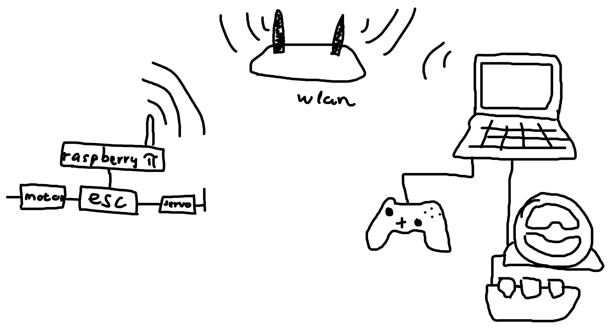
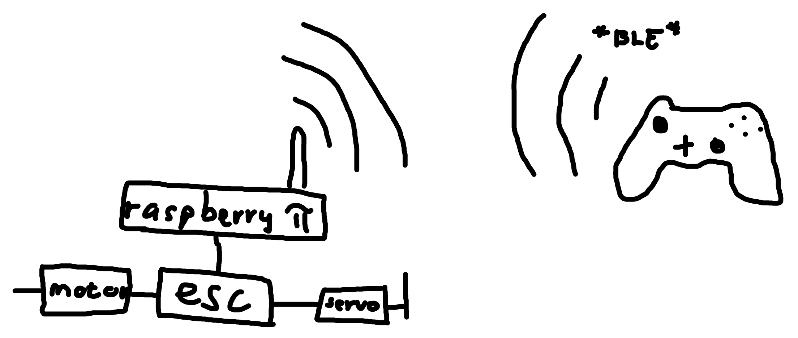

# RC joystick
Controlling an RC car with different controllers/gamepads remotely.

## library dependecy
https://github.com/drewnoakes/joystick

## Hardware
- Raspberry PI 3B
- (Raspi cam)
- Hobbywing 1060 Brushed ESC
- Wltoys 14001
- Stock servo (with sg90 control board)

## How it works

**Raspberry pi**: 
The Pi runs only a [pigpiod](http://abyz.me.uk/rpi/pigpio/pigpiod.html) daemon which receives commands through TCP socket. The command packets send by the remote computer.

**Remote computer**: Runs the program which is in this repository. The program connect to the pi through TCP socket, and sends the messages to it to perform different actions.
We can control the RC car with the devices connected to the remote pc (e.g. controller, steering wheel).

## Different versions
This repository contains different versions of the program.
- `remote_g29.cpp`: With this we can control the rc with a Logitect G29 Steering wheel.
- `remote-control/send-pigpiod-with-pigpiif.cpp`: the previous version of the program, but same functionality. the program with asio works the same but uses the asio library for the communication. These programs are made for conntrolling the car with an Xbox One joystick.
- `direct-control/joy-control`: With this you can control the car directly. You connect the controller (wired/wireless) to the RPI and you can control it. 

**Communication of the remote versions:**

**Direct version of the software:**

## Videos
- RC Steering with controller: https://www.youtube.com/watch?v=ucxDSpEDDrU
- Controller wired to the pc: https://www.youtube.com/watch?v=QKCFVQfY3sk